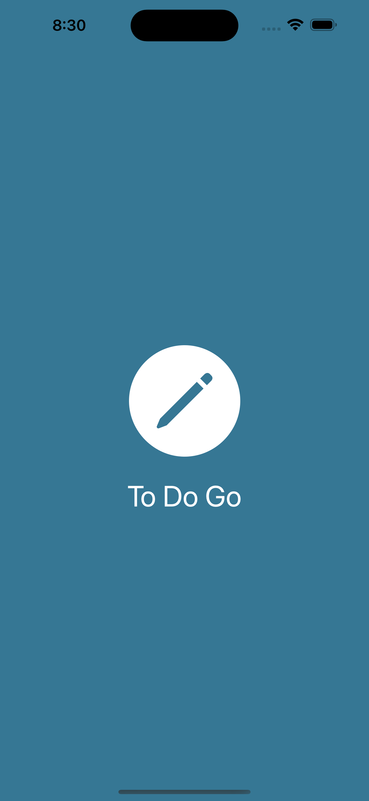
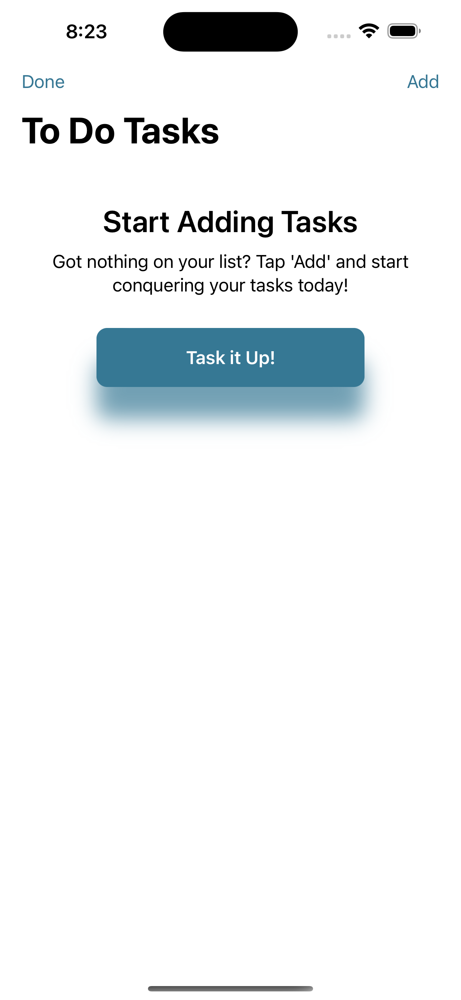
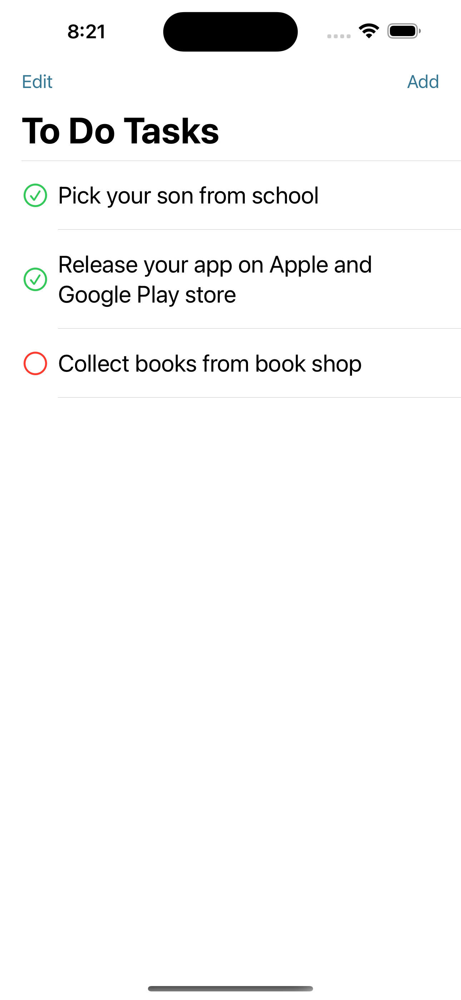
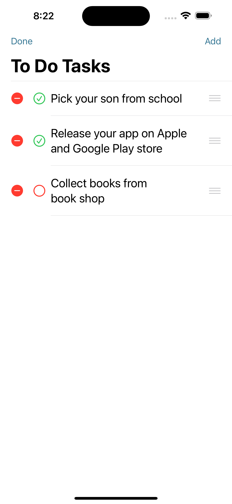
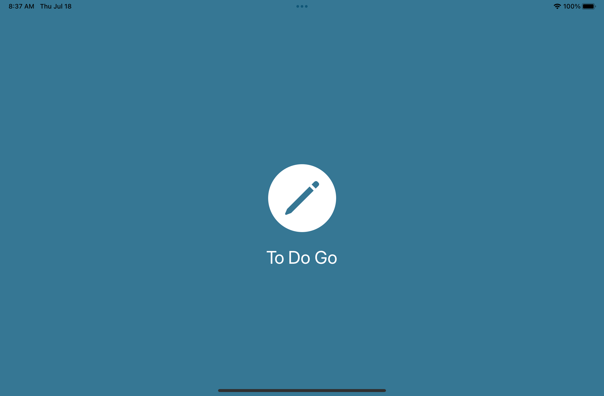
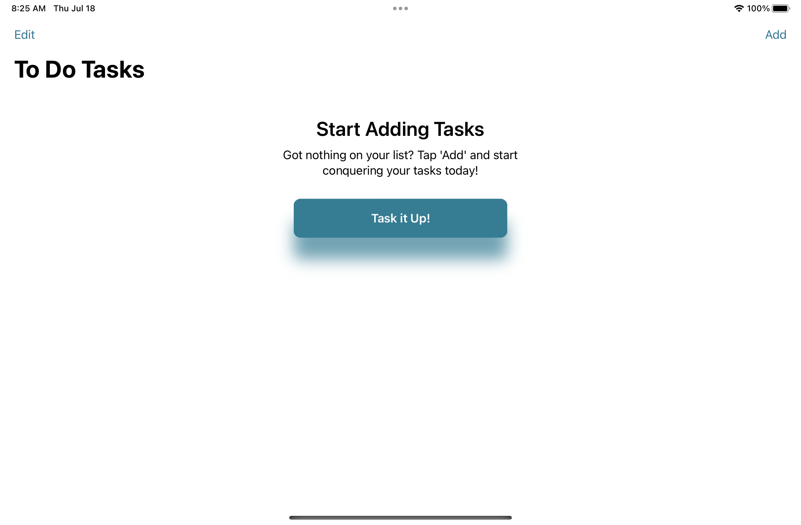
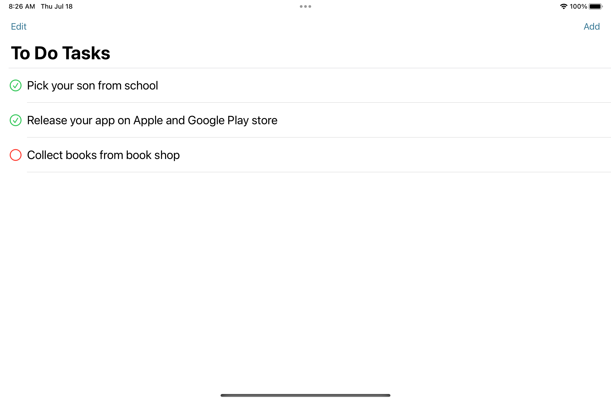
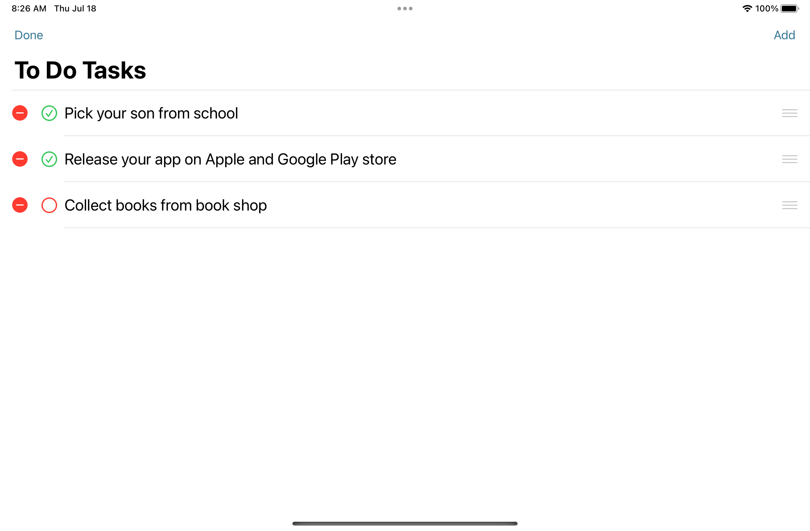

# To Do Go

## Overview

"To Do Go" is a SwiftUI-based mobile app designed for iPhone and iPad, following the MVVM (Model-View-ViewModel) architecture. This application allows users to manage their to-do lists efficiently with a user-friendly interface.

## Main Features

- **Todo List Management:** Create, edit, and delete tasks seamlessly.
- **MVVM Architecture:** Separation of concerns with distinct layers for View, ViewModel, and Model.
- **Data Persistence:** Uses UserDefaults for data storage, ensuring simple data persistence.
- **Adaptive UI:** Optimized for various device configurations including iPhone vs iPad, Portrait vs Landscape, and Light vs Dark mode.

## Development Process

### Screens

- **View Layer:** Built the UI components for task management and new item creation.
- **Model Layer:** Defined the Model to encapsulate task data.
- **ViewModel Layer:** Implemented business logic for data operations including downloading, updating, adding, and saving tasks.
- **Persistence:** Used UserDefaults for storing app data due to its simplicity and ease of implementation.
- **User Experience:** Added animations and feedback messages to enhance user interaction and clarity.
- **Configuration:** Ensured compatibility across different device types and orientations.

### Final Touches

- **App Icon and Launch Screen:** Included final visuals to enhance app branding and user experience.

## Screenshots

### iPhone 

&emsp;&emsp;&emsp;

### iPad

&emsp;&emsp;

&emsp;&emsp;

## Installation

No installation steps are required as this project is designed as an educational example.

## Contributing

Contributions are what make the open-source community such an amazing place to learn, inspire, and create. Any contributions you make are greatly appreciated! Here are some ways you can get started:

- **Report bugs:** If you encounter any bugs, please let us know. Open up an issue and let us know the problem.
- **Contribute code:** If you are a developer and want to contribute, follow the instructions below to get started!
- **Suggestions:** If you don't want to code but have some awesome ideas, open up an issue explaining some updates or improvements you would like to see!
- **Documentation:** If you see the need for some additional documentation, feel free to add some!

If you have a suggestion that would make this better, please fork the repo and create a pull request. You can also simply open an issue with the tag "enhancement". Don't forget to give the project a star! Thanks again!

### Instructions

1. Fork this repository.
2. Clone the forked repository.
3. Create your Feature Branch (`git checkout -b feature/AmazingFeature`).
4. Commit your Changes (`git commit -m 'Add some AmazingFeature'`).
5. Push to the Branch (`git push origin feature/AmazingFeature`).
6. Open a Pull Request.

## Credits

Developed by Seher Ayesha

## License

This project is licensed under the MIT License - see the [LICENSE.md](LICENSE.md) file for details.
